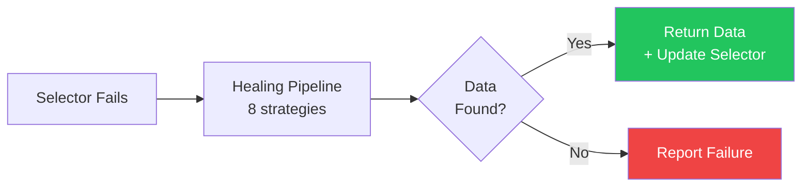
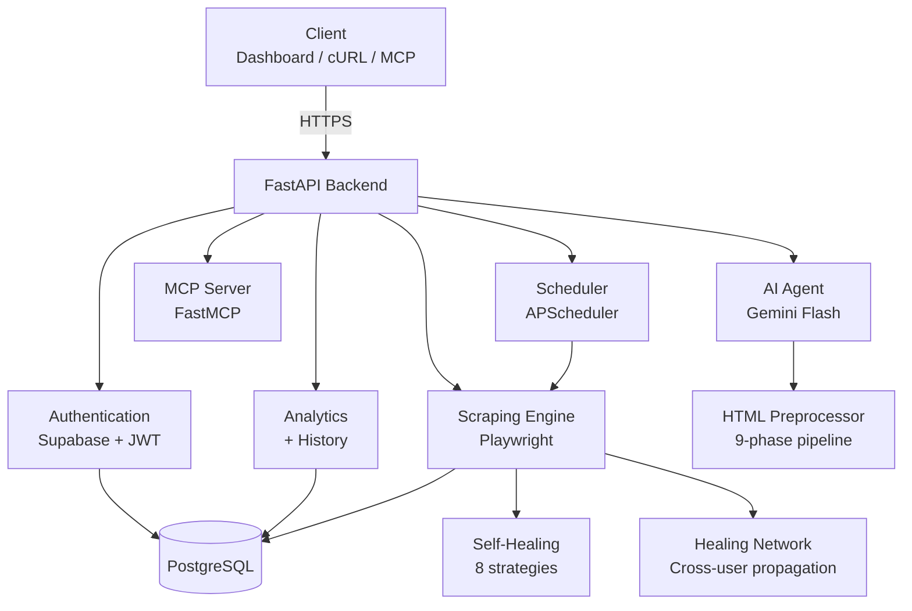

<div align="center">

# ElementAPI

**Turn any webpage into a self-healing REST API — no CSS knowledge required.**

Describe what data you want in plain English, or provide a CSS selector. Get a live API endpoint. When the website changes its layout, your API keeps working — automatically.

[](https://python.org)
[](https://fastapi.tiangolo.com)
[](https://playwright.dev)
[](https://modelcontextprotocol.io)

[Live App](https://elementapi.vercel.app) · [API Docs](#api-reference) · [How Healing Works](#self-healing-pipeline) · [MCP Integration](#mcp-integration)

</div>

---

## The Problem

Web scraping is fragile. A website changes one CSS class name and your entire pipeline breaks. You fix it manually. It breaks again next week. And writing CSS selectors in the first place requires inspecting DOM trees — a barrier for most users.

**ElementAPI solves both problems.** Describe what you want in plain English ("get all product prices") and an AI agent finds the right selector for you. When the website changes its layout, an 8-strategy healing pipeline automatically relocates your data — no manual fixes, no downtime.

## How It Works

```
You provide:  URL + description (or CSS selector)
                        ↓
AI Agent:     Analyzes page HTML → Generates CSS selector → Validates it
                        ↓
ElementAPI:   Fetches page → Extracts data → Returns JSON
                        ↓ (if selector breaks later)
              Runs 8 healing strategies → Finds data → Updates selector
                        ↓
You get:      Clean JSON every time, healed automatically
```

### Three Ways to Create

| Method | What you provide | Best for |
|--------|-----------------|----------|
| **AI Agent** | URL + plain English description | No CSS knowledge needed |
| **Manual** | URL + CSS selector | Power users who know exactly what they want |
| **Multi-field** | URL + multiple field descriptions | Extracting structured data (name, price, rating, etc.) |

### Quick Example

**With the AI Agent (no CSS selector needed):**
```bash
curl -X POST https://elementapi-backend.onrender.com/api/v1/endpoints \
  -H "Authorization: Bearer <token>" \
  -H "Content-Type: application/json" \
  -d '{"name": "HN Top Stories", "url": "https://news.ycombinator.com", "description": "all the story title links on the front page"}'
```

**With a CSS selector:**
```bash
curl -X POST https://elementapi-backend.onrender.com/api/v1/endpoints \
  -H "Authorization: Bearer <token>" \
  -H "Content-Type: application/json" \
  -d '{"name": "HN Top Stories", "url": "https://news.ycombinator.com", "selector": ".titleline > a"}'
```

**Use your API:**
```bash
curl https://elementapi-backend.onrender.com/api/v1/run/hn-top-stories \
  -H "X-API-Key: sk_live_xxxxx"

# Response
{
  "api": "hn-top-stories",
  "data": ["Show HN: ...", "Ask HN: ...", "Launch: ..."],
  "source": "live",
  "healed": false
}
```

---

## AI Agent

The selector generation agent eliminates the CSS knowledge requirement entirely. Users describe what they want in plain English, and the agent handles everything.

This is not a single LLM call — it's a **validate-and-retry loop**:

```
1. Fetch page with Playwright (shared browser instance)
2. Compress HTML through 9-phase preprocessor (200KB → ~10KB skeleton)
3. Send skeleton + user description to Gemini Flash
4. LLM returns: { selector, confidence, neighbor_text, tag_name, reasoning }
5. VALIDATE: run selector against actual page HTML
   ├─ Got data? → Accept, create endpoint
   ├─ 0 matches? → Feedback: "matched 0 elements, try again"
   ├─ Too broad? → Feedback: "too many matches, be more specific"
   ├─ Empty text? → Feedback: "elements have no text"
   └─ Container? → Feedback: "matched a container, target leaf elements"
6. Max 3 attempts. If all fail → return error with best guess
```

Agent-created endpoints are **born healed** — the `neighbor_text` and `tag_name` context that powers the self-healing pipeline is populated from day one, rather than waiting for the first successful scrape.

| Setting | Value |
|---------|-------|
| **Model** | Gemini 2.0 Flash |
| **Temperature** | 0.1 |
| **Max Attempts** | 3 (with error feedback between attempts) |
| **Cost** | 15 credits per successful generation |

---

## Self-Healing Pipeline

When a CSS selector stops matching, ElementAPI activates a multi-stage healing pipeline that combines structural analysis, fuzzy matching, and content similarity to automatically relocate your target data.



The pipeline uses **8 strategies** ordered by reliability:

1. **Neighbor text** — finds elements near known text anchors
2. **Tag-only** — matches by HTML tag type
3. **Class fuzzy** — fuzzy-matches renamed CSS classes
4. **ID match** — locates elements by ID patterns
5. **Attribute match** — matches by data attributes
6. **Parent → child** — navigates structural relationships
7. **Nth sibling shift** — handles element repositioning
8. **Text content match** — finds elements by their text content

Key design decisions:
- **Priority-ordered cascade** — faster, more reliable strategies run first
- **Automatic selector updates** — once healed, the new selector is persisted so future requests are instant
- **Cross-user healing network** — when a selector heals for one user, the fix propagates to all users scraping the same domain + path pattern
- **Healing feedback loop** — users can confirm or reject heals, building labeled training data for future model improvements
- **Graceful degradation** — if all strategies fail, the API returns a clear error rather than stale/wrong data

---

## Multi-Field Endpoints

Extract multiple data points from a single page in one request:

```bash
curl -X POST https://elementapi-backend.onrender.com/api/v1/endpoints \
  -H "Authorization: Bearer <token>" \
  -H "Content-Type: application/json" \
  -d '{
    "name": "Product Info",
    "url": "https://example.com/product",
    "fields": [
      {"field_name": "title", "description": "the product title"},
      {"field_name": "price", "description": "the current price"},
      {"field_name": "rating", "description": "the star rating"}
    ]
  }'
```

Each field uses the AI agent independently, and each field self-heals independently — so if the price element moves but the title doesn't, only the price selector gets updated.

---

## MCP Integration

ElementAPI exposes a native [Model Context Protocol](https://modelcontextprotocol.io) server, letting AI assistants like Claude Desktop create and manage scrapers autonomously.

**Claude Desktop configuration:**
```json
{
  "mcpServers": {
    "elementapi": {
      "url": "https://elementapi-backend.onrender.com/mcp",
      "headers": {
        "X-API-Key": "sk_live_xxxxx"
      }
    }
  }
}
```

**Available MCP tools:**

| Tool | Description |
|------|-------------|
| `create_scraper` | Create single or multi-field scrapers with AI-generated selectors |
| `scrape` | Run a scrape, automatically handles self-healing, returns JSON |
| `list_scrapers` | List all your scrapers, status, schedules, and data previews |
| `set_schedule` | Set or pause scheduled cron runs for any endpoint |
| `delete_scraper` | Delete an endpoint |

---

## Scheduled Scraping

Automate data collection with scheduled scrapes:

```bash
# Set a schedule (runs every 120 minutes)
curl -X PUT https://elementapi-backend.onrender.com/api/v1/endpoints/hn-top-stories/schedule \
  -H "Authorization: Bearer <token>" \
  -H "Content-Type: application/json" \
  -d '{"interval": "every 120m"}'
```

| Constraint | Value |
|------------|-------|
| **Minimum interval** | 60 minutes |
| **Max active schedules** | 5 per account |
| **Input format** | Integer minutes (e.g., `every 120m`) |

Scheduled scrapes run in the background via APScheduler. Results are stored in scrape history and accessible via the history/export API.

---

## Architecture



## Tech Stack

| Layer | Technology | Why |
|-------|-----------|-----|
| **Framework** | FastAPI | Async support, auto-generated OpenAPI docs, dependency injection |
| **Database** | PostgreSQL + SQLAlchemy 2.0 | Relational integrity, migration support via Alembic |
| **Browser** | Playwright (Chromium) | Headless rendering for JavaScript-heavy pages |
| **AI Agent** | Google Gemini Flash | Fast, cheap LLM for selector generation (direct API, no SDK) |
| **MCP** | FastMCP | Native Model Context Protocol server for AI assistant integration |
| **Auth** | Supabase + JWT | Managed auth with local JWT verification for speed |
| **Scheduler** | APScheduler | Persistent background job scheduling |
| **Stealth** | playwright-stealth + fake-useragent | Bypass bot detection on target sites |
| **Alerting** | Webhooks | User-configured alerts for scrape failures, heals, and data delivery |
| **Frontend** | SvelteKit + Tailwind | Reactive dashboard with sessionStorage caching, deployed on Vercel |
| **Deployment** | Render (backend) + Vercel (frontend) | Zero-config deploys with auto-scaling |

---

## Credit System

ElementAPI uses a credit-based model. All accounts receive **250 free credits** on signup.

| Action | Credit Cost |
|--------|-------------|
| Manual scrape (selector provided) | 1 credit |
| Scheduled scrape | 1 credit |
| AI agent selector generation (success) | 15 credits |
| AI agent selector generation (failure) | 0 credits |
| Self-healing (automatic) | 5 credits |

| Platform Limit | Value |
|----------------|-------|
| **Max APIs** | 40 per account |
| **Max active schedules** | 5 per account |
| **Min schedule interval** | 60 minutes |

---

## Engineering Highlights

- **Modular package structure** — routes, schemas, services, and utilities are fully separated with clear boundaries
- **Dependency injection** — FastAPI's DI system manages database sessions, auth context, and service lifecycles
- **Database migrations** — Alembic handles all schema changes with full rollback support
- **Comprehensive test suite** — Pytest with mocked network requests to validate healing strategies deterministically
- **Type safety** — Full type hints + Pydantic schemas across the entire codebase
- **9-phase HTML preprocessor** — Compresses 200KB pages to ~10KB LLM-digestible skeletons
- **Cross-user healing network** — Healing fixes propagate across users on the same domain
- **Schema inference** — Auto-detects data types (prices, dates, URLs, etc.) on extracted content
- **SessionStorage caching** — Dashboard loads instantly on tab navigation with background data sync

---

## Usage Guide

### Step 1: Create an Account

Sign up at [elementapi.vercel.app](https://elementapi.vercel.app). Every account starts with **250 free credits**.

### Step 2: Create an API Endpoint

From the dashboard, click **Create New API** and choose your method:

| Tab | What you provide | How it works |
|-----|-----------------|--------------|
| **AI Agent** | URL + plain English description | AI finds the right selector for you |
| **Manual** | URL + CSS selector | You specify the exact selector |
| **Multi-field** | URL + multiple field descriptions | Extract structured data with multiple fields |

Or via cURL (AI Agent):

```bash
curl -X POST https://elementapi-backend.onrender.com/api/v1/endpoints \
  -H "Authorization: Bearer <your-token>" \
  -H "Content-Type: application/json" \
  -d '{"name": "HN Top Stories", "url": "https://news.ycombinator.com", "description": "all the story title links"}'
```

### Step 3: Consume Your API

Use the `X-API-Key` header (found in **Settings > API Key** on the dashboard):

```bash
curl https://elementapi-backend.onrender.com/api/v1/run/hn-top-stories \
  -H "X-API-Key: sk_live_xxxxx"
```

**Python:**
```python
import requests

response = requests.get(
    "https://elementapi-backend.onrender.com/api/v1/run/hn-top-stories",
    headers={"X-API-Key": "sk_live_xxxxx"}
)
print(response.json()["data"])
```

**JavaScript:**
```javascript
const res = await fetch(
  "https://elementapi-backend.onrender.com/api/v1/run/hn-top-stories",
  { headers: { "X-API-Key": "sk_live_xxxxx" } }
);
const { data } = await res.json();
console.log(data);
```

### Step 4: That's It

If the target website changes its layout, ElementAPI will automatically heal the selector and keep returning your data. No manual maintenance required.

---

## API Reference

All endpoints are prefixed with `/api/v1`. Authentication is via Bearer token (dashboard) or `X-API-Key` header (external scripts).

### Authentication

| Method | Endpoint | Description |
|--------|----------|-------------|
| `POST` | `/auth/signup` | Create a new account |
| `POST` | `/auth/signin` | Sign in and get access token |
| `POST` | `/auth/change-password` | Change password (authenticated) |
| `POST` | `/auth/forgot-password` | Send password reset email |
| `GET` | `/auth/key` | Get your API key |

### Endpoints (CRUD)

| Method | Endpoint | Description |
|--------|----------|-------------|
| `GET` | `/endpoints` | List all your endpoints |
| `POST` | `/endpoints` | Create a new endpoint (manual, agent, or multi-field) |
| `PUT` | `/endpoints/{slug}` | Update an endpoint |
| `DELETE` | `/endpoints/{slug}` | Delete an endpoint |

### Scraping

| Method | Endpoint | Description |
|--------|----------|-------------|
| `GET` | `/run/{slug}` | Execute a scrape (supports `?test=true`) |

### Scheduling

| Method | Endpoint | Description |
|--------|----------|-------------|
| `PUT` | `/endpoints/{slug}/schedule` | Set or update a schedule |
| `DELETE` | `/endpoints/{slug}/schedule` | Remove a schedule |
| `GET` | `/endpoints/{slug}/schedule` | Get schedule status |

### Analytics & Billing

| Method | Endpoint | Description |
|--------|----------|-------------|
| `GET` | `/billing/me` | Get credits, limits, and account status |
| `GET` | `/billing/packs` | List available credit packs |
| `GET` | `/tier` | Get tier configuration |
| `GET` | `/usage` | Get current usage stats |
| `GET` | `/analytics/summary?range=30d` | Aggregate metrics (requests, success rate) |
| `GET` | `/analytics/time-series?range=7d` | Daily request and success breakdown |

### History & Export

| Method | Endpoint | Description |
|--------|----------|-------------|
| `GET` | `/history/{slug}?limit=10` | View scrape history |
| `GET` | `/history/{slug}/export?format=csv` | Export history (CSV/JSON) |

### Healing Feedback

| Method | Endpoint | Description |
|--------|----------|-------------|
| `PATCH` | `/healing/{event_id}/feedback` | Confirm or reject an auto-heal |

### MCP

| Method | Endpoint | Description |
|--------|----------|-------------|
| `*` | `/mcp` | Streamable HTTP MCP endpoint (for AI assistants) |

### Health

| Method | Endpoint | Description |
|--------|----------|-------------|
| `GET` | `/status` | Returns `{"status": "operational"}` |

---

## Security

- **SSRF Protection** — URL validation blocks requests to private, loopback, link-local, and unresolvable addresses
- **robots.txt Compliance** — Respects robots.txt rules before scraping (configurable per endpoint)
- **Rate Limiting** — Sliding-window rate limiter on all endpoints, with stricter limits on auth routes
- **Token-based Auth** — JWT authentication for dashboard access, API key authentication for external scripts and MCP
- **Input Validation** — Strict Pydantic schema validation on all user inputs
- **Resource Blocking** — Playwright blocks images, media, fonts, and stylesheets to minimize attack surface and bandwidth
- **Route Interception** — Per-request SSRF checks on in-page redirects during browser navigation
