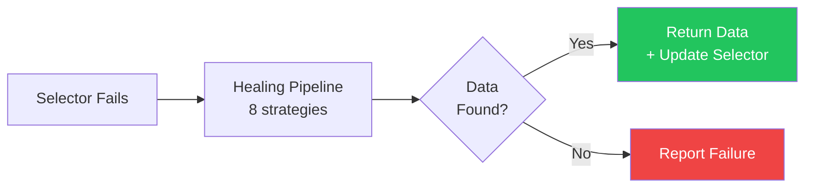
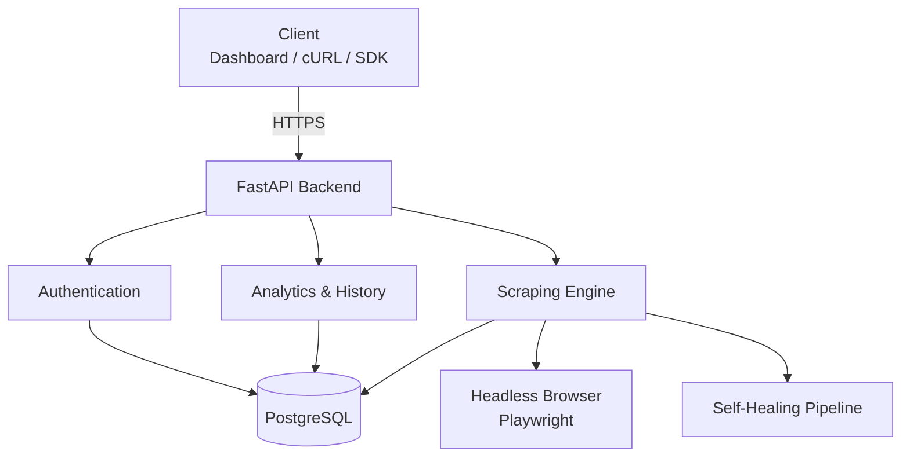

<div align="center">

# ElementAPI

**Turn any webpage element into a self-healing REST API.**

Point at a CSS selector. Get a live API endpoint. When the website changes its layout, your API keeps working — automatically.

[](https://python.org)
[](https://fastapi.tiangolo.com)
[](https://playwright.dev)

[Live App](https://elementapi.vercel.app) · [API Docs](#api-reference) · [How Healing Works](#self-healing-pipeline)

</div>

---

## The Problem

Web scraping is fragile. A website changes one CSS class name and your entire pipeline breaks. You fix it manually. It breaks again next week.

**ElementAPI solves this.** Create an API endpoint by providing a URL and CSS selector. When the website changes its layout, an 8-strategy healing pipeline automatically finds your data — no manual fixes, no downtime.

## How It Works

```
You provide:  URL + CSS Selector + (optional context)
                        ↓
ElementAPI:   Fetches page → Tries selector → Returns JSON
                        ↓ (if selector fails)
              Runs 8 healing strategies → Finds data → Updates selector
                        ↓
You get:      Clean JSON every time, healed automatically
```

### Quick Example

```bash
# Create an API
curl -X POST https://your-api.onrender.com/api/v1/endpoints \
  -H "Authorization: Bearer <token>" \
  -H "Content-Type: application/json" \
  -d '{"name": "HN Top Stories", "url": "https://news.ycombinator.com", "selector": ".titleline > a"}'

# Use it
curl https://your-api.onrender.com/api/v1/run/hn-top-stories \
  -H "X-API-Key: sk_live_xxxxx"

# Response
{
  "api": "hn-top-stories",
  "data": ["Show HN: ...", "Ask HN: ...", "Launch: ..."],
  "source": "live",
  "healed": false
}
```

---

## Self-Healing Pipeline

When a CSS selector stops matching (because the target website changed its layout), ElementAPI doesn't just fail — it activates a multi-stage healing pipeline that combines structural analysis, fuzzy matching, and content similarity to automatically relocate your target data.



The pipeline uses **8 proprietary strategies** ordered by reliability — ranging from DOM structure analysis and fuzzy class matching to content-aware fallbacks. Each strategy is designed to handle a specific category of website change (class renames, element repositioning, structural rewrites, etc.).

Key design decisions:
- **Priority-ordered cascade** — faster, more reliable strategies run first
- **Automatic selector updates** — once healed, the new selector is persisted so future requests are instant
- **Graceful degradation** — if all strategies fail, the API returns a clear error rather than stale/wrong data

---

## Architecture



The backend follows a modular, layered architecture — routes, services, and data access are fully decoupled with dependency injection throughout.

## Tech Stack

| Layer | Technology | Why |
|-------|-----------|-----|
| **Framework** | FastAPI | Async support, auto-generated OpenAPI docs, dependency injection |
| **Database** | PostgreSQL + SQLAlchemy 2.0 | Relational integrity, migration support via Alembic |
| **Browser** | Playwright (Chromium) | Headless rendering for JavaScript-heavy pages |
| **Auth** | Supabase + JWT | Managed auth with local JWT verification for speed |
| **Stealth** | playwright-stealth + fake-useragent | Bypass bot detection on target sites |
| **Frontend** | Vanilla HTML/CSS/JS + Tailwind | Simple, fast, deployed on Vercel |
| **Deployment** | Render (backend) + Vercel (frontend) | Zero-config deploys with auto-scaling |

---

## Engineering Highlights

- **Modular package structure** — routes, schemas, services, and utilities are fully separated with clear boundaries
- **Dependency injection** — FastAPI's DI system manages database sessions, auth context, and service lifecycles
- **Database migrations** — Alembic handles all schema changes with full rollback support
- **Comprehensive test suite** — Pytest with mocked network requests to validate healing strategies deterministically
- **Type safety** — Full type hints + Pydantic schemas across the entire codebase

---

## API Reference

All endpoints are prefixed with `/api/v1`. Authentication is via Bearer token (dashboard) or `X-API-Key` header (external scripts).

### Authentication

| Method | Endpoint | Description |
|--------|----------|-------------|
| `POST` | `/auth/signup` | Create a new account |
| `POST` | `/auth/signin` | Sign in and get access token |
| `POST` | `/auth/change-password` | Change password (authenticated) |
| `POST` | `/auth/forgot-password` | Send password reset email |
| `GET` | `/auth/key` | Get your API key |

### Endpoints (CRUD)

| Method | Endpoint | Description |
|--------|----------|-------------|
| `GET` | `/endpoints` | List all your endpoints |
| `POST` | `/endpoints` | Create a new endpoint |
| `PUT` | `/endpoints/{slug}` | Update an endpoint |
| `DELETE` | `/endpoints/{slug}` | Delete an endpoint |

### Scraping

| Method | Endpoint | Description |
|--------|----------|-------------|
| `GET` | `/run/{slug}` | Execute a scrape (supports `?test=true`) |

### Analytics & History

| Method | Endpoint | Description |
|--------|----------|-------------|
| `GET` | `/tier` | Get your tier limits |
| `GET` | `/usage` | Get current usage stats |
| `GET` | `/analytics/stats?time_range=7d` | Daily request breakdown |
| `GET` | `/history/{slug}?limit=10` | View scrape history |
| `GET` | `/history/{slug}/export?format=csv` | Export history (CSV/JSON) |

### Health

| Method | Endpoint | Description |
|--------|----------|-------------|
| `GET` | `/status` | Returns `{"status": "operational"}` |

---

## Security

- **SSRF Protection** — URL validation blocks requests to private, loopback, and link-local addresses
- **robots.txt Compliance** — Respects robots.txt rules before scraping
- **Rate Limiting** — Sliding-window rate limiter on all endpoints, with stricter limits on auth routes
- **Token-based Auth** — JWT authentication for dashboard access, API key authentication for external scripts
- **Input Validation** — Strict schema validation on all user inputs

---
